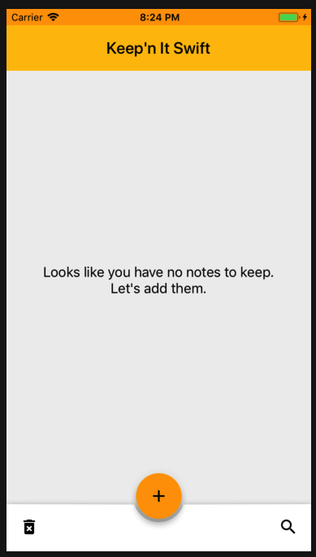
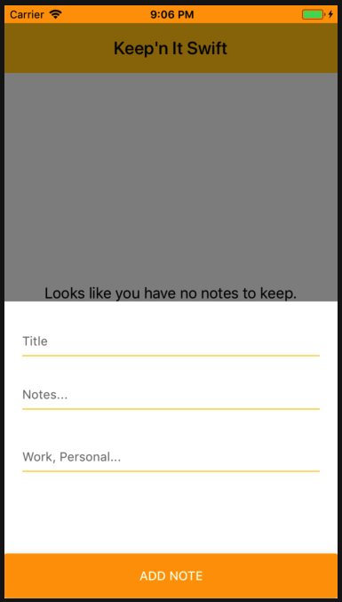
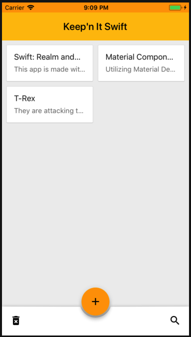
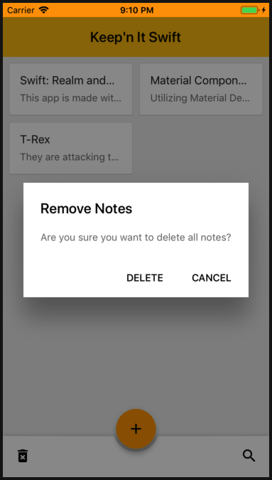

# Keep'n It Swift

Simple iOS Swift version of Google Keep app.
User can add notes, delete notes.

<b>Features List:

- [x] Add Note
- [x] Remove All Notes
- [ ] Search notes
- [ ] Modify note.
- [ ] Delete single note.

#### Libraries Used

* [RealmSwift](https://realm.io/products/realm-database)

* [Material Design Components for iOS](https://material.io/components/ios/)

#### Demo Shots

